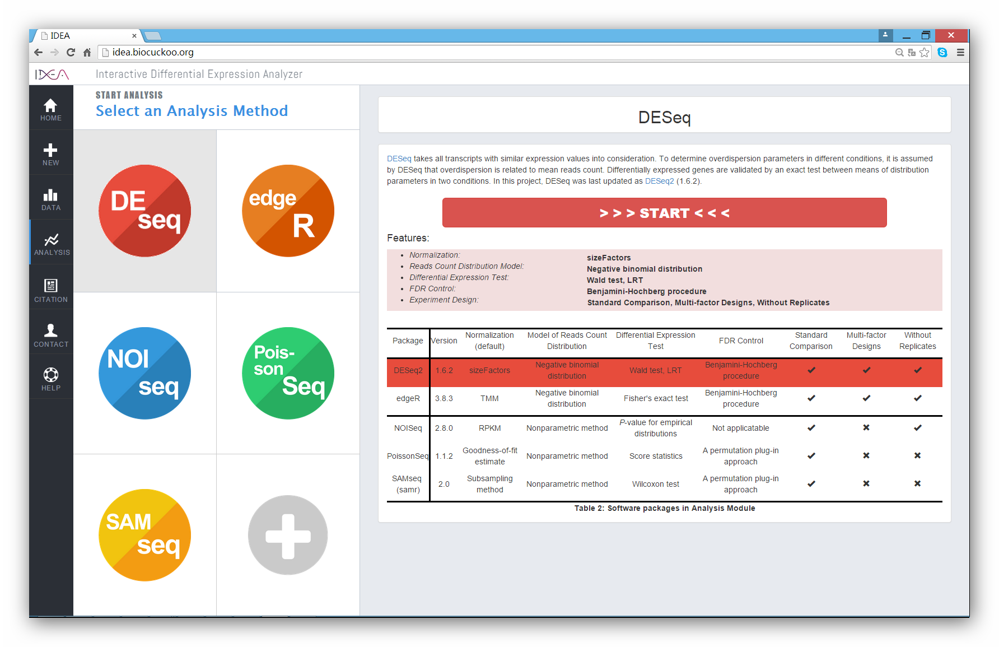

IDEA
=============
[](https://travis-ci.org/likelet/IDEA)
[](https://codebeat.co/projects/github-com-likelet-idea-master)
<p>    High-throughput sequencing technology is rapidly becoming the standard method for measuring gene expression at the transcriptional level. One of the main goals of such work is to identify differentially expressed genes under two or more conditions. A number of computational tools , such as <a href="http://bioconductor.org/packages/release/bioc/html/DESeq.html/">DESeq</a> (<a href="http://www.ncbi.nlm.nih.gov/pubmed/20979621/">Anders and Huber 2010</a>) (updated as <a href="http://bioconductor.org/packages/release/bioc/html/DESeq2.html/">DESeq2</a> (<a href="http://www.ncbi.nlm.nih.gov/pubmed/25516281/">Love, Huber et al. 2014</a>)), <a href="http://bioconductor.org/packages/release/bioc/html/edgeR.html/">edgeR</a> (<a href="http://www.ncbi.nlm.nih.gov/pubmed/19910308/">Robinson, McCarthy et al. 2010</a>, <a href="http://www.ncbi.nlm.nih.gov/pubmed/24753412/">Zhou, Lindsay et al. 2014</a>), <a href="http://www.bioconductor.org/packages/release/bioc/html/NOISeq.html/">NOISeq</a> (<a href="http://www.ncbi.nlm.nih.gov/pubmed/21903743/">Tarazona, García-Alcalde et al. 2011</a>), <a href="http://cran.r-project.org/web/packages/PoissonSeq/index.html/">PoissonSeq</a> (<a href="http://www.ncbi.nlm.nih.gov/pubmed/22003245/">Li, Witten et al. 2011</a>), and <a href="http://www.inside-r.org/packages/cran/samr/docs/SAMseq/">SAMseq (samr)</a> (<a href="http://www.ncbi.nlm.nih.gov/pubmed/22127579/">Li and Tibshirani 2013</a>) and Cuffdiff (Trapnell, et al., 2013) have been developed for the analysis of differential gene expression from patterns in RNA-seq data. Most of these tools are implemented in R language, which is commonly used for the analysis of high-dimensional expression data. However, a fairly high level of programing skill is required when applying these R tools to screen out differentially expressed genes, greatly hindering the application of these tools since many biology researchers have little programing experience. Beyond this problem, due to a lack of an interactive interface in these tools, it is inconvenient to adjust the analytical parameters, even for advanced users. Moreover, since different packages generate inconsistent results, an interactive platform that combines these tools together is necessary for obtaining more solid analysis results.<br/>
To address the above issues, here we introduce the Interactive Differential Expression Analyzer (IDEA), a Shiny-based web application dedicated to the identification of differential expression genes in an interactive way. IDEA was built as a user-friendly and highly interactive utility using the <a href="http://shiny.rstudio.com/">Shiny</a> (RStudio Inc. 2014)  package in R. Currently, five relevant R packages are integrated into IDEA. IDEA is capable of visualizing the results with plenty of charts and tables, as well as providing great ease of interaction during the course of the analysis.<br/>
<p/>

[Click here to redirect to IDEA website.](http://idea.biocuckoo.org)<br />

**Screen shoot of IDEA**


Install IDEA locally
-------------
The online version can be easily accessed to perform analysis tasks with dataset in low thoughput. However, Limited to remote server resouces, the web page usually stucked while multible user operated parallelly or larger dataset tasks requirement. To solve this, We released an R package that packed the core analysis module for users to run analysis under the R environment locally .<br/>
_Before install the IDEA package, please read this markdown file carefully;_<br/>
First, to run IDEA functionally in a local machine, you must make sure that all the dependencies were well installed.***（We recommanded users using [Rstudio](https://www.rstudio.com/products/rstudio/download/) as their R console to make a better installing exprience)***<br/>
To check the dependencies installed correctly, this command can help users to check the status of each installation<br/>
```R
library("Packages for check")
```

To date, the current version(IDEA 1.0) works well based on the following versions of dependencies<br/>
    shiny (>= 0.12.2),<br/>
    DESeq2 (>= 1.6.2),<br/>
    __shinyBS (<= 0.25),<br/>__
    shinysky (>= 0.1.2),<br/>
    edgeR (>= 3.2.4),<br/>
    NOISeq (>= 2.8.0),<br/>
    samr (>= 2.0),<br/>
    PoissonSeq (>= 1.1.2),<br/>
    ggplot2 (>= 1.0.1),<br/>
    FactoMineR (>= 1.27),<br/>
    VennDiagram (>= 1.6.5),<br/>
    rmarkdown (>= 0.2.53),<br/>
    RobustRankAggreg (>= 1.1)<br/>
    gplots (>= 2.13.0)<br/>
    labeling (>=0.3)<br/>
    pheatmap (>= 0.7.7)
<br/>

__User should notice that , the latest **shinyBS**  is incompatible with IDEA at present ; Only the exact shingBS  version (0.25) keep the IDEA work smoothly . This is because current shinyBS removed the__ ```
progressBar()
``` __function used in IDEA. To install the compatible shinyBS, you can type__
```R
devtools::install_github( "likelet/shinyBS")
```
We also list the command to install the related packages:
```R
cDep <- c("abind")
#dependencies from BIOCONDUCTOR
bcDep <- c("Biobase", "BiocGenerics", "S4Vectors", "IRanges", "GenomeInfoDb", "GenomicRanges","impute")
#target from CRAN
cTgt <- c("PoissonSeq","FactoMineR","samr","ggplot2","VennDiagram","RobustRankAggreg","shiny","rmarkdown","Cairo","gplots","pheatmap","labeling")
#target from BIOCONDUCTOR
bcTgt <- c("edgeR", "DESeq2","NOISeq")


###INSTALLED PACKAGES
#get installed list
inst <- packageStatus()$inst

#check and install DEPENDENCIES from CRAN
for(i in 1:length(cDep)){
  tag = which(inst$Package == cDep[i])
  if(length(tag)){
    remove.packages(cDep[i])
  }
  install.packages(cDep[i])
}
#check and install DEPENDENCIES from BIOCONDUCTOR
source("http://bioconductor.org/biocLite.R")
for(i in 1:length(bcDep)){
  tag = which(inst$Package == bcDep[i])
  if(length(tag))
    remove.packages(bcDep[i])
  biocLite(bcDep[i])
}

#check and install TARGET packages
for(i in 1:length(cTgt)){
  install.packages(cTgt[i])
}
for(i in 1:length(bcTgt)){

  biocLite(bcTgt[i])
}

devtools::install_github("shiny-incubator", "rstudio")
devtools::install_github( "likelet/shinyBS")
devtools::install_github("AnalytixWare/ShinySky")
```
Second, to install the latest development build directly from GitHub, run this:(For some reason, we did not release the current version on CRAN or BIOCONDUCTOR site):

```R
if (!require("devtools"))
  install.packages("devtools")
devtools::install_github("likelet/IDEA")
```
The above command can automaticly install the several dependencies which allows users skipping some installation steps; However, the shinyBS package would be latest version which will result in incompatible with IDEA. User can remove it and reinstall the right version to avoid this;
Alternately, if you have installed dependencies manually, you can then install IDEA pakcage alone with following command :
```R
if (!require("devtools"))
  install.packages("devtools")
devtools::install_github("likelet/IDEA",dependencies = FALSE)
```
or download it from git then install package with install command<br/>
```R
install.packages("path_to_IDEA.tar.gz/.zip", repos = NULL, type="source")
```

Run information
-------------
**For computer with GUI**<br/>
Clone repository into local path and run as a Shiny App <br/>
example:  <br/>
Clone repository into local directory '/Document/IDEA' (so that ui.R locates as '/Document/IDEA/ui.R') <br/>
then run in R under work directory of '/Document' : <br/>
```R
runApp("IDEA")
```
<br/>
Also, after install IDEA pakcages with no error print,  users can simply input<br/>
```R
runIDEA()
``` 
function to run application locally; Since there is only one function in this package, you can also print help massege in your R console;

**For server or computer without GUI (Run IDEA on a server)**<br/>
Install shiny-server first and finish the configurations step according to [http://rstudio.github.io/shiny-server/latest/](http://rstudio.github.io/shiny-server/latest/)<br/>
Pull the package and install dependencies into your R environment; <br/>
Copy _IDEA_ folder under _inst_ dir into /srv/shiny-sever/ (or orther app location configured in `shiny-sever.conf` file)<br/>
Configure the server network/firewall options like open the shiny port(3838 default), internal IP access (please refer to shiny-server configuration step);<br/>

Access the server ip address along with port number and enjoy your IDEA analysis trip :).<br/>

Developing Environment
-------------

R version 3.1.2
Packages:
Shiny (0.12.2), ShinySky(0.1.2), shinyIncubator (3.2.4),shinyBS(0.25) and their dependencies <br/>
DESeq2 (1.6.2), edgeR (3.2.4), SAMseq (2.0), PoissonSeq (1.1.2), NOISeq (2.8.0) and their dependencies <br/>
ggplot2, reshape, plyr, scale, RColorBrewer and other packages needed in plotting.

Documentation
-------------

First stable version released.
To view user guide, please visit [http://idea.biocuckoo.org](http://targetgene.com:3838/IDEA/) and refers to **HELP** section
Developer Information
-------------
FAQ
-------------
During the analysis procedure,  you might encounter the following problems due to software or environment ; We summarized those questions and give some solutions for bug fixing:<br/>
***1. Several packages can not be installed with errors returned, how to fix this?***<br/>
__Answer__: Yes, the R pakcages' installation is indeed painful. Mostly you can restart your computer or change the network environment to fix it; If the problem still exists, please try to install packages locally  or contact authors for help;<br/>
***2. "Error : unrecognized fields specified in html_dependency: attachment" while clicks the download report button***:<br/>
__Answer__: This error is mainly caused by Rstudio version; you can fix it by upgrading your RStudio to the latest version.<br/>
***3. "Error: pandoc version 1.12.3 or higher is required and was not found." while clicks the download report button***:<br/>
__Answer__: If you see this message that means you upgraded your Rstudio version, the problem is still exist. You need a pandoc to render Rmd file into html report. You can optain it from [https://github.com/jgm/pandoc/releases/tag/1.15.0.6](https://github.com/jgm/pandoc/releases/tag/1.15.0.6) as YiHui suggested. After that, restart your Rstudio.<br/>
***4. "My data is more than 10M which reaches the max data set limit in the IDEA, how can I perform analysis for this data ?"***:<br/>
__Answer__: Well, we encourage users modifying source code to achieve their goals. To make big data analysis available, user can edit "server.R" file under the IDEA folder in the R_HOME library. There is a line "options(shiny.maxRequestSize=10*1024^2) # max file size is 10Mb" in the source code. You can reset the number and save it to make bigger data analysis available.<br/>
***5. "I got error messages on install "Cario" in R environment(linux), how to fix it ?"***:<br/>
__Answer__: To install Cairo in R , your system  should already have some library file like cairo-devel, libXt-devel installed, after that, reinstall Cairo.<br/>

### Designers:
Jian Ren, renjian.sysu@gmail.com<br/>
Qi Zhao, zhaoqi3@mail2.sysu.edu.cn<br/>

### Developers:
Qi Zhao, zhaoqi3@mail2.sysu.edu.cn <br/>
Peng Nie, niepeng@mail2.sysu.edu.cn <br/>
Rucheng Diao, diaorch@mail2.sysu.edu.cn <br/>
Lichen Sun, sunlch@mail2.sysu.edu.cn <br/>
Yi Shi, shiy26@mail2.sysu.edu.cn

### Maintainer:
Qi Zhao, Peng Nie <br/>
Please feel free contact us. <br/>

### Copyright
Copyright © 2014-2017. The CUCKOO Workgroup. All Rights Reserved<br/>
For more useful tools/applications, please go to [biocuckoo.org](http://www.biocuckoo.org)

### Citation 
If you used any one of IDEA intergrated R packages in your publications, please cite the related packages by<br/>```citations(packagesname)```;<br/>
Also, if you adopted intergrated analysis module, report page as well as other fancy plots generated by IDEA, please cite the IDEA in the same way; <br/>
The publication of IDEA is in preparation, we will release the citation info as soon as possible.
